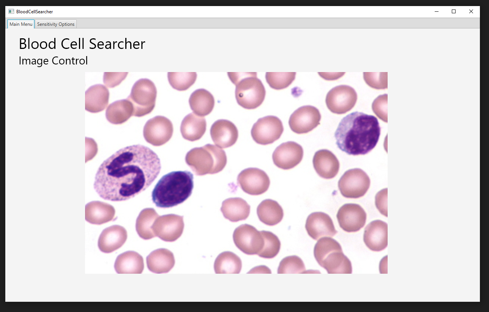

# Blood Cell Search
### Introduction
This is a repository for an application that I created. The goal of this application is to take in an image of a dyed slide of blood, and be able to count the amount of white and red blood cells in it. It features options to help tweak how sensitive the application is when it comes to identifying cells.

This app was written in Java and makes use of [JavaFX](https://openjfx.io//) and [Scenebuilder](https://gluonhq.com/products/scene-builder/) to manage and create the UI. It makes use of a Disjoint-Set data type to identify blood cells and get their size.

